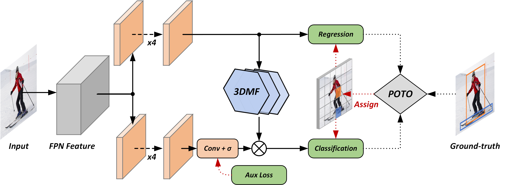

# End-to-End Object Detection with Fully Convolutional Network


This project provides an implementation for "[End-to-End Object Detection with Fully Convolutional Network](https://arxiv.org/abs/2012.03544)" on PyTorch.

Experiments in the paper were conducted on the internal framework, thus we reimplement them on [cvpods](https://github.com/Megvii-BaseDetection/cvpods) and report details as below.



## Requirements
* [cvpods](https://github.com/Megvii-BaseDetection/cvpods)
* scipy >= 1.5.4

## Get Started

* install cvpods locally (requires cuda to compile)
```shell

python3 -m pip install 'git+https://github.com/Megvii-BaseDetection/cvpods.git'
# (add --user if you don't have permission)

# Or, to install it from a local clone:
git clone https://github.com/Megvii-BaseDetection/cvpods.git
python3 -m pip install -e cvpods

# Or,
pip install -r requirements.txt
python3 setup.py build develop
```

* prepare datasets
```shell
cd /path/to/cvpods
cd datasets
ln -s /path/to/your/coco/dataset coco
```

* Train & Test
```shell
git clone https://github.com/Megvii-BaseDetection/DeFCN.git
cd DeFCN/playground/detection/coco/poto.res50.fpn.coco.800size.3x_ms  # for example

# Train
pods_train --num-gpus 8

# Test
pods_test --num-gpus 8 \
    MODEL.WEIGHTS /path/to/your/save_dir/ckpt.pth # optional
    OUTPUT_DIR /path/to/your/save_dir # optional

# Multi node training
## sudo apt install net-tools ifconfig
pods_train --num-gpus 8 --num-machines N --machine-rank 0/1/.../N-1 --dist-url "tcp://MASTER_IP:port"

```

## Results on COCO2017 val set

| model | assignment | with NMS | lr sched. | mAP | mAR | download |
|:------|:----------:|:--------:|:---------:|:---:|:---:|:--------:|
| [FCOS](./playground/detection/coco/fcos.res50.fpn.coco.800size.3x_ms) | one-to-many | Yes | 3x + ms | 41.4 | 59.1 | [weight](https://megvii-my.sharepoint.cn/:u:/g/personal/wangjianfeng_megvii_com/EZqKwaeqJVVGnZ40JdSMWuMBE9UiI9RTeiiTqQZIpb74_A?e=9yKhaD) \| [log](https://megvii-my.sharepoint.cn/:u:/g/personal/wangjianfeng_megvii_com/Ee8is-872ihCi7wdaoGlJsYBImnU3KghkB8G2FxeDfLtzA?e=Gbzcle) |
| [FCOS baseline](./playground/detection/coco/fcos.res50.fpn.coco.800size.3x_ms.wo_ctrness) | one-to-many | Yes | 3x + ms | 40.9 | 58.4 | [weight](https://megvii-my.sharepoint.cn/:u:/g/personal/wangjianfeng_megvii_com/EZgRNxwNi2BCoTGTWEPJpXUBZfTzjXHJ9QNkyt5mbOzvbw?e=OUItCW) \| [log](https://megvii-my.sharepoint.cn/:u:/g/personal/wangjianfeng_megvii_com/ERkRyqXjGtVAp6vjEhg8hQABHxO_083fLd32K9dY3KqYKQ?e=WrNbCj) |
| [Anchor](./playground/detection/coco/anchor.res50.fpn.coco.800size.3x_ms) | one-to-one | No | 3x + ms | 37.1 | 60.5 | [weight](https://megvii-my.sharepoint.cn/:u:/g/personal/wangjianfeng_megvii_com/EZfdTFoDS11HrIKaiLNJHXwBDEnoCKmUWB19yzUc5b_S3w?e=nCYmC0) \| [log](https://megvii-my.sharepoint.cn/:u:/g/personal/wangjianfeng_megvii_com/EXv5m1QVygpPss-ooQJfuV0BdTZF7zcUc00lAjG8vOlqYw?e=KliIJt) |
| [Center](./playground/detection/coco/center.res50.fpn.coco.800size.3x_ms) | one-to-one | No | 3x + ms | 35.2 | 61.0 | [weight](https://megvii-my.sharepoint.cn/:u:/g/personal/wangjianfeng_megvii_com/Ee44xccaO2VMh81dNy4qSpYBjcvzYOC9QKoJTNGeOXyv9w?e=UxxIFI) \| [log](https://megvii-my.sharepoint.cn/:u:/g/personal/wangjianfeng_megvii_com/EVazPkcL7hZCqZOzTf9eePwBBL-gWvPEUvpdFB5rl9rE7Q?e=KfUs4v) |
| [Foreground Loss](./playground/detection/coco/loss.res50.fpn.coco.800size.3x_ms) | one-to-one | No | 3x + ms | 38.7 | 62.2 | [weight](https://megvii-my.sharepoint.cn/:u:/g/personal/wangjianfeng_megvii_com/EdgBB6Oo_VlGtBrlNz3LnoIBdP5LDbgpGOowinIPboWOUw?e=7l4f6I) \| [log](https://megvii-my.sharepoint.cn/:u:/g/personal/wangjianfeng_megvii_com/EdEuZ0A1N1FHogFx4ty53IQBYDjBdgG5UIrhoWJyvFBhCg?e=XgcwP7) |
| [POTO](./playground/detection/coco/poto.res50.fpn.coco.800size.3x_ms) | one-to-one | No | 3x + ms | 39.2 | 61.7 | [weight](https://megvii-my.sharepoint.cn/:u:/g/personal/wangjianfeng_megvii_com/EZX8SOLYaaxJo7XKNNZLn2cB9jN3NVCcuIcnU5d6K63NgQ?e=PhGxcv) \| [log](https://megvii-my.sharepoint.cn/:u:/g/personal/wangjianfeng_megvii_com/EUUkcuelrv1ElRAKw8WUgmgBGbBL8KmbIxnyINuf1w9Rrg?e=450Iy8) |
| [POTO + 3DMF](./playground/detection/coco/poto.res50.fpn.coco.800size.3x_ms.3dmf) | one-to-one | No | 3x + ms | 40.6 | 61.6 | [weight](https://megvii-my.sharepoint.cn/:u:/g/personal/wangjianfeng_megvii_com/EUZSG4S8NEhPuAIyEWoWcQABfkuSNKFxjQ2lUe5qHWm1Hw?e=cmZT05) \| [log](https://megvii-my.sharepoint.cn/:u:/g/personal/wangjianfeng_megvii_com/EdpWv-1qoKFIsLmpXt35ZMwBiU2eUV5q24oqbIXRp7ulsg?e=TdH3Bl) |
| [POTO + 3DMF + Aux](./playground/detection/coco/poto.res50.fpn.coco.800size.3x_ms.3dmf.aux) | mixture\* | No | 3x + ms | 41.4 | 61.5 | [weight](https://megvii-my.sharepoint.cn/:u:/g/personal/wangjianfeng_megvii_com/ER5BQQA5--ZKtzA6Ta5wBYMBGnqS1MtpFp21kPf973jccw?e=v9XZma) \| [log](https://megvii-my.sharepoint.cn/:u:/g/personal/wangjianfeng_megvii_com/EUYDEZIQXK5CtABKoq-du5UB-71q4EsNStYaTLPDuoY6bw?e=LmzXMd) |

\* We adopt a one-to-one assignment in POTO and a one-to-many assignment in the auxiliary loss, respectively.

- `2x + ms` schedule is adopted in the paper, but we adopt `3x + ms` schedule here to achieve higher performance.
- It's normal to observe ~0.3AP noise in POTO.

## Results on CrowdHuman val set

| model | assignment | with NMS | lr sched. | AP50 | mMR | recall | download |
|:------|:----------:|:--------:|:---------:|:----:|:---:|:------:|:--------:|
| [FCOS](./playground/detection/crowdhuman/fcos.res50.fpn.crowdhuman.800size.30k) | one-to-many | Yes | 30k iters | 86.1 | 54.9 | 94.2 | [weight](https://megvii-my.sharepoint.cn/:u:/g/personal/wangjianfeng_megvii_com/EZDPyk8zwotOjzMzZXeZevABOjIyt_lcV2rUJWXmCpNgzQ?e=21mkyL) \| [log](https://megvii-my.sharepoint.cn/:u:/g/personal/wangjianfeng_megvii_com/ET6G2ot5vTJLgXhENPkypysBRIyr_bcO_ZL6OAZ-EfXEJg?e=TTdtUQ) |
| [ATSS](./playground/detection/crowdhuman/atss.res50.fpn.crowdhuman.800size.30k) | one-to-many | Yes | 30k iters | 87.2 | 49.7 | 94.0 | [weight](https://megvii-my.sharepoint.cn/:u:/g/personal/wangjianfeng_megvii_com/EV-vStDncgJPhTzs5EhBNl8BNkTm2JSkKmpJCXbkiYEU6Q?e=0avzwA) \| [log](https://megvii-my.sharepoint.cn/:u:/g/personal/wangjianfeng_megvii_com/EYe5cT7PhzdOoFxZUjy_nQQBtRqeyceMkIhOfCrSF9RH9A?e=ruRkNi) |
| [POTO](./playground/detection/crowdhuman/poto.res50.fpn.crowdhuman.800size.30k) | one-to-one | No | 30k iters | 88.5 | 52.2 | 96.3 | [weight](https://megvii-my.sharepoint.cn/:u:/g/personal/wangjianfeng_megvii_com/EZ_c5aS2Ky9AuGFhTDXkwPwBk6-q2ZLb9ivVgqX7SHf0vw?e=eQexvu) \| [log](https://megvii-my.sharepoint.cn/:u:/g/personal/wangjianfeng_megvii_com/EXj_cYe6D-1EmtsT6oCbCDoBjGDFy00R6LLtj8DBWyppuQ?e=7HrKqs) |
| [POTO + 3DMF](./playground/detection/crowdhuman/poto.res50.fpn.crowdhuman.800size.30k.3dmf) | one-to-one | No | 30k iters | 88.8 | 51.0 | 96.6 | [weight](https://megvii-my.sharepoint.cn/:u:/g/personal/wangjianfeng_megvii_com/EXBg0_zevohPijFLGXJopAcBqo6EBdwttrZfZDyyOfb-Xg?e=bcRpef) \| [log](https://megvii-my.sharepoint.cn/:u:/g/personal/wangjianfeng_megvii_com/EXBuggGAXLREp7s8BGthJ1sBLfj244hnHkE0ewlSBDNc8w?e=6jheh5) |
| [POTO + 3DMF + Aux](./playground/detection/crowdhuman/poto.res50.fpn.crowdhuman.800size.30k.3dmf.aux) | mixture\* | No | 30k iters | 89.1 | 48.9 | 96.5 | [weight](https://megvii-my.sharepoint.cn/:u:/g/personal/wangjianfeng_megvii_com/EUTUwS403eZCi32gOv1NKWsBunZYWzstvp9r1XbIq7OSEw?e=aAjfnf) \| [log](https://megvii-my.sharepoint.cn/:u:/g/personal/wangjianfeng_megvii_com/EY7mBmChZHhLp7H1SqAzPc4BCfEjCK0-zz3lDQke3znxGg?e=m1eea2) |

\* We adopt a one-to-one assignment in POTO and a one-to-many assignment in the auxiliary loss, respectively.

- It's normal to observe ~0.3AP noise in POTO, and ~1.0mMR noise in all methods.

## Ablations on COCO2017 val set

| model | assignment | with NMS | lr sched. | mAP | mAR | note |
|:------|:----------:|:--------:|:---------:|:---:|:---:|:----:|
| [POTO](./playground/detection/coco/poto.res50.fpn.coco.800size.6x_ms) | one-to-one | No | 6x + ms | 40.0 | 61.9 | |
| [POTO](./playground/detection/coco/poto.res50.fpn.coco.800size.9x_ms) | one-to-one | No | 9x + ms | 40.2 | 62.3 | |
| [POTO](./playground/detection/coco/poto.res50.fpn.coco.800size.3x_ms.argmax) | one-to-one | No | 3x + ms | 39.2 | 61.1 | replace Hungarian algorithm by `argmax` |
| [POTO + 3DMF](./playground/detection/coco/poto.res50.fpn.coco.800size.3x_ms.3dmf_wo_gn) | one-to-one | No | 3x + ms | 40.9 | 62.0 | remove GN in 3DMF |
| [POTO + 3DMF + Aux](./playground/detection/coco/poto.res50.fpn.coco.800size.3x_ms.3dmf_wo_gn.aux) | mixture\* | No | 3x + ms | 41.5 | 61.5 | remove GN in 3DMF |

\* We adopt a one-to-one assignment in POTO and a one-to-many assignment in the auxiliary loss, respectively.

- For `one-to-one` assignment, more training iters lead to higher performance.
- The `argmax` (also known as top-1) operation is indeed the approximate solution of bipartite matching in dense prediction methods.
- It seems harmless to remove GN in 3DMF, which also leads to higher inference speed.

## Acknowledgement
This repo is developed based on cvpods. Please check [cvpods](https://github.com/Megvii-BaseDetection/cvpods) for more details and features.

## License
This repo is released under the Apache 2.0 license. Please see the LICENSE file for more information.

## Citing
If you use this work in your research or wish to refer to the baseline results published here, please use the following BibTeX entries:
```
@article{wang2020end,
  title   =  {End-to-End Object Detection with Fully Convolutional Network},
  author  =  {Wang, Jianfeng and Song, Lin and Li, Zeming and Sun, Hongbin and Sun, Jian and Zheng, Nanning},
  journal =  {arXiv preprint arXiv:2012.03544},
  year    =  {2020}
}
```

## Contributing to the project
Any pull requests or issues about the implementation are welcome. If you have any issue about the library (e.g. installation, environments), please refer to [cvpods](https://github.com/Megvii-BaseDetection/cvpods).
